# MVP — Engenharia de Dados
## Pipeline de Dados BRFSS 2015 — Diabetes

**Aluno:** João Paulo do Espírito Santo Queiroz  
**Matrícula:** 4052026000865  
**Data:** 26/09/2026  
**Ambiente:** Databricks Free Edition  
**Tecnologia:** PySpark  

---

## 1. Contexto e objetivo

Este projeto foi desenvolvido como MVP da disciplina de Engenharia de Dados, utilizando a base **CDC Diabetes Health Indicators (BRFSS 2015)**.

A base reúne informações relacionadas à saúde, hábitos e características dos participantes e também foi utilizada anteriormente em um projeto de Machine Learning sobre diabetes.

O objetivo deste trabalho é construir um pipeline de dados no Databricks, seguindo a **Arquitetura Medalhão**, com as camadas Bronze, Silver e Gold.

### Perguntas do trabalho

1. Como os participantes estão distribuídos entre as classificações sem diabetes, pré-diabetes e diabetes?
2. Qual é o perfil do BMI dos participantes da base?
3. Quais indicadores de saúde e hábitos apresentam diferenças entre os grupos relacionados ao diabetes?

---

## 2. Fonte dos dados

**Dataset:** CDC Diabetes Health Indicators (BRFSS 2015)

**Fonte original:**  
https://archive.ics.uci.edu/dataset/891/cdc+diabetes+health+indicators

**Arquivo utilizado:**  
`diabetes_012_health_indicators_BRFSS2015.csv`

A base utilizada possui **253.680 registros e 22 colunas**.

---

## 3. Arquitetura do pipeline

O pipeline foi organizado utilizando a Arquitetura Medalhão:

### Bronze

A camada Bronze armazena os dados provenientes do arquivo CSV original.

Nesta etapa foram realizadas verificações da estrutura dos dados, valores nulos e registros duplicados.

### Silver

Na camada Silver foram realizados tratamentos e padronizações dos tipos de dados.

As variáveis representadas por códigos foram convertidas para valores inteiros, enquanto a variável `BMI` foi mantida como tipo decimal.

### Gold

Na camada Gold os dados foram agregados por classificação da variável `Diabetes_012`.

A tabela final apresenta a quantidade e o percentual de participantes em cada classificação, facilitando a análise dos dados.

---

## 4. Qualidade dos dados

A análise de qualidade identificou:

- **253.680 registros**
- **22 colunas**
- Nenhum valor nulo identificado
- **23.899 registros duplicados**
- **9,42% de registros duplicados**

Os registros duplicados foram mantidos, considerando que participantes diferentes podem apresentar respostas idênticas para as variáveis analisadas.

---

## 5. Análise dos dados

### Distribuição das classes

A camada Gold apresentou:

| Classificação | Quantidade | Percentual |
|---|---:|---:|
| Sem diabetes | 213.703 | 84,24% |
| Pré-diabetes | 4.631 | 1,83% |
| Diabetes | 35.346 | 13,93% |

Os resultados mostram um desbalanceamento entre as três classificações.

### BMI

O BMI médio encontrado em cada grupo foi:

| Classificação | BMI médio |
|---|---:|
| Sem diabetes | 27,74 |
| Pré-diabetes | 30,72 |
| Diabetes | 31,94 |

Nesta base, os grupos classificados com pré-diabetes e diabetes apresentam BMI médio maior que o grupo sem diabetes.

### Indicadores de saúde e hábitos

| Grupo | Pressão alta | Colesterol alto | Atividade física | Histórico de tabagismo |
|---|---:|---:|---:|---:|
| Sem diabetes | 37,11% | 37,92% | 77,91% | 42,97% |
| Pré-diabetes | 62,90% | 62,08% | 67,85% | 49,28% |
| Diabetes | 75,27% | 67,01% | 63,05% | 51,82% |

Os resultados mostram diferenças entre os grupos, principalmente nos indicadores relacionados à pressão alta, colesterol, atividade física e histórico de tabagismo.

---

## 6. Conclusão

Neste trabalho foi desenvolvido um pipeline de Engenharia de Dados utilizando PySpark no Databricks, seguindo a Arquitetura Medalhão.

O processo permitiu acompanhar os dados desde sua ingestão na camada Bronze, passando pelo tratamento na Silver, até sua organização e agregação na camada Gold.

As análises realizadas também permitiram responder às perguntas definidas no início do trabalho e identificar diferenças entre os grupos relacionados ao diabetes.

---

## 7. Autoavaliação

Considero que consegui atingir os principais objetivos propostos para este MVP. Foi possível realizar a ingestão dos dados no Databricks, organizar o pipeline seguindo as camadas Bronze, Silver e Gold, verificar a qualidade dos dados e realizar as análises definidas no início do trabalho.

Durante o desenvolvimento, também consegui aplicar na prática conceitos de Engenharia de Dados e relacionar este trabalho com o projeto de Machine Learning desenvolvido anteriormente utilizando a mesma base.

Como ponto de melhoria, considero que o pipeline pode ser ampliado futuramente com novas transformações, análises e formas de automatização do processamento dos dados.

## Evidências de execução do pipeline

A seguir são apresentadas evidências da execução do pipeline de Engenharia de Dados no Databricks, incluindo a persistência das tabelas utilizadas na Arquitetura Medalhão e os resultados obtidos nas análises realizadas.

### Persistência das tabelas no Databricks

O catálogo do Databricks evidencia a persistência das tabelas utilizadas nas três camadas da Arquitetura Medalhão: Bronze, Silver e Gold.

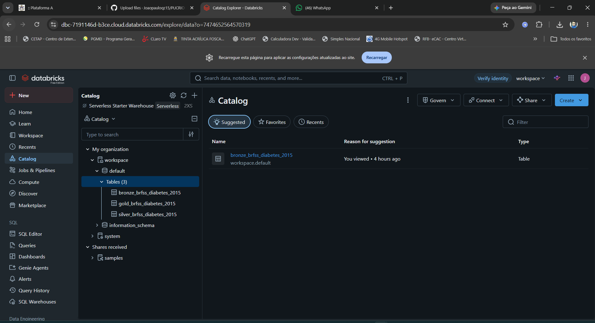

### Camada Bronze

As imagens a seguir apresentam evidências da ingestão e da validação inicial dos dados na camada Bronze.

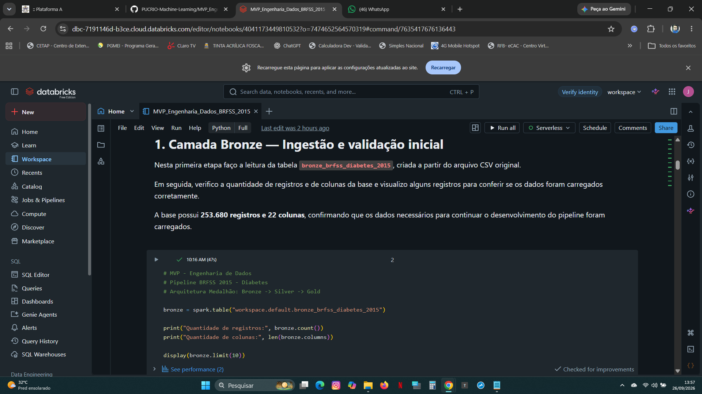

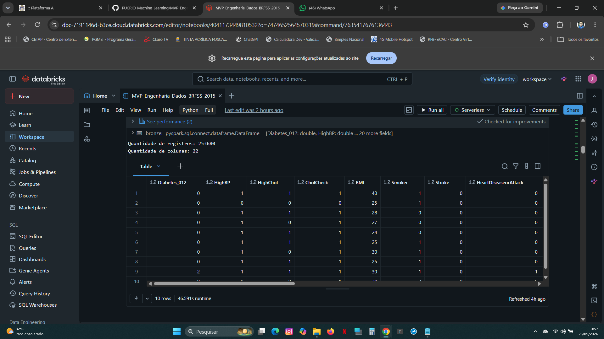

### Camada Silver

As imagens a seguir apresentam etapas do tratamento, preparação e validação dos dados na camada Silver.

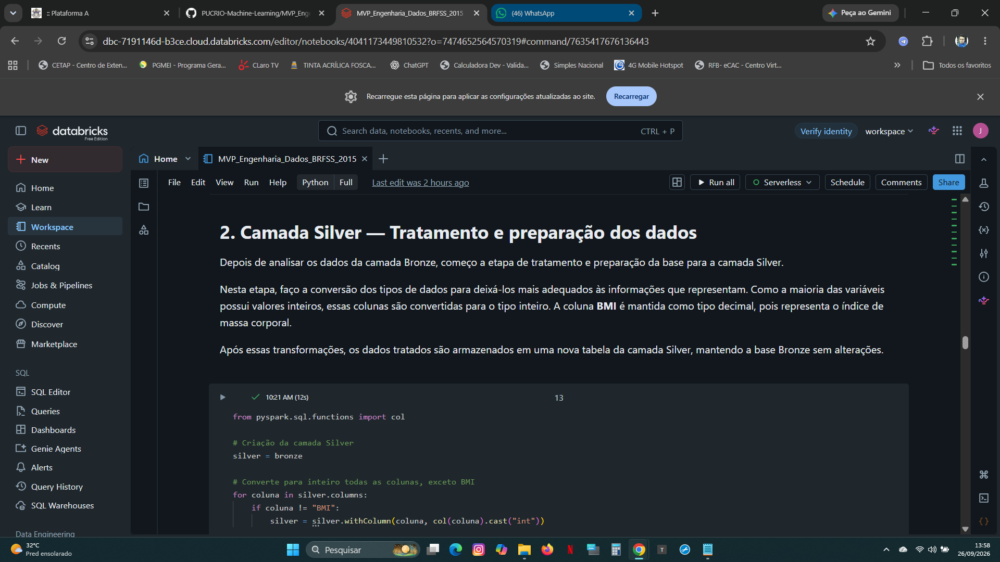

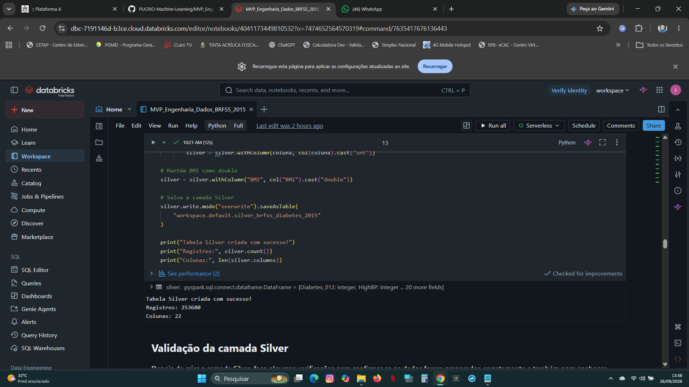

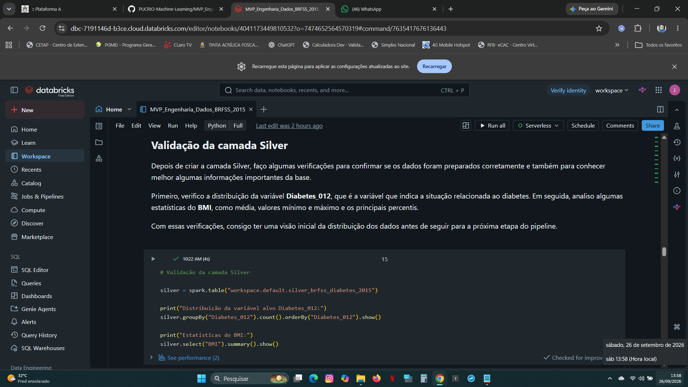

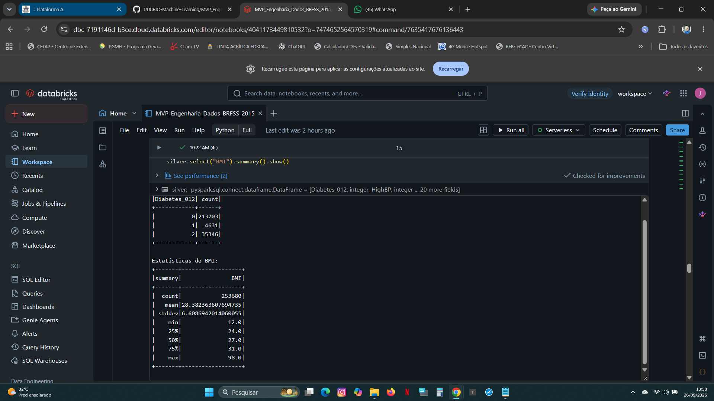

### Análise do BMI

As evidências abaixo apresentam a análise do BMI dos participantes considerando as classificações da variável Diabetes_012.

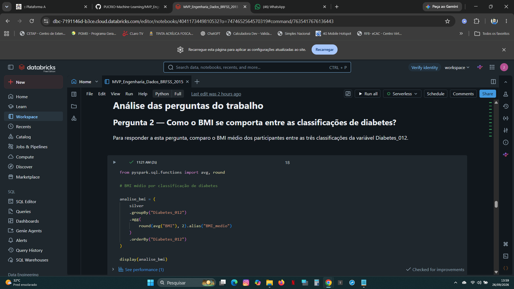

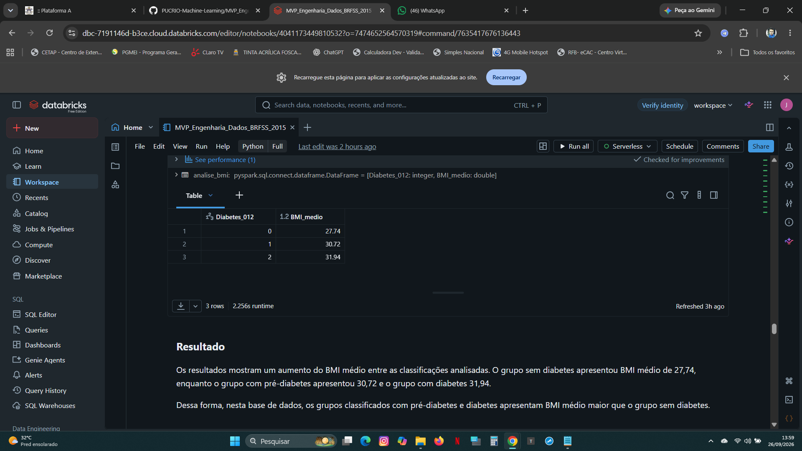

### Camada Gold e resultados das análises

As imagens a seguir apresentam os resultados consolidados das análises e a organização dos dados na camada Gold.

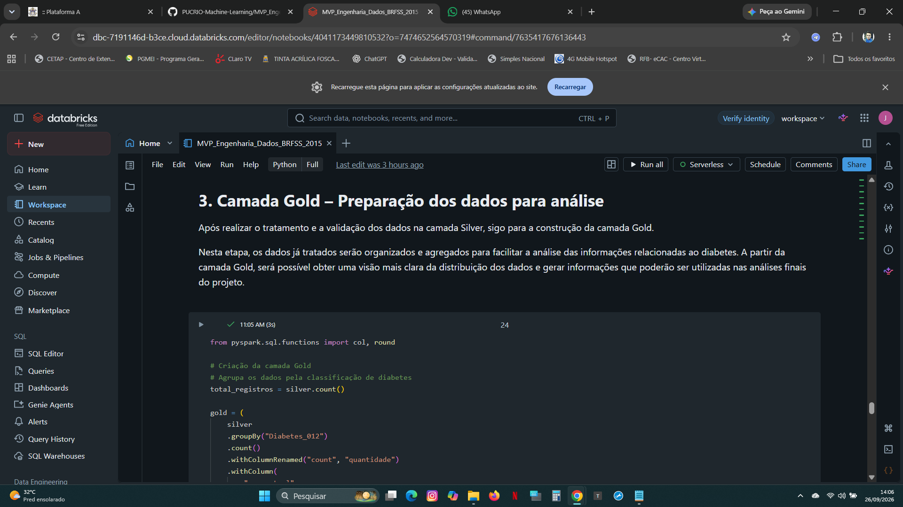

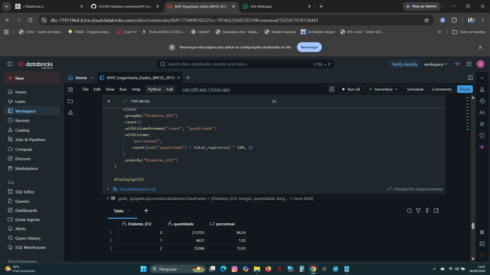

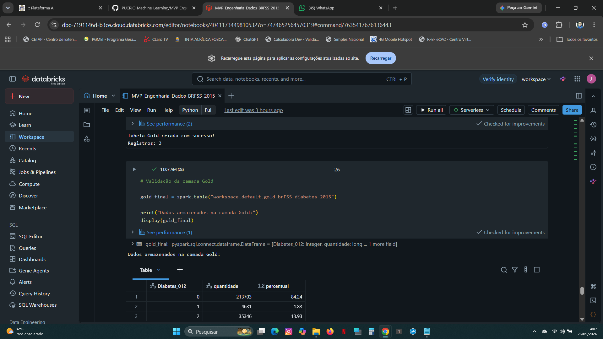
